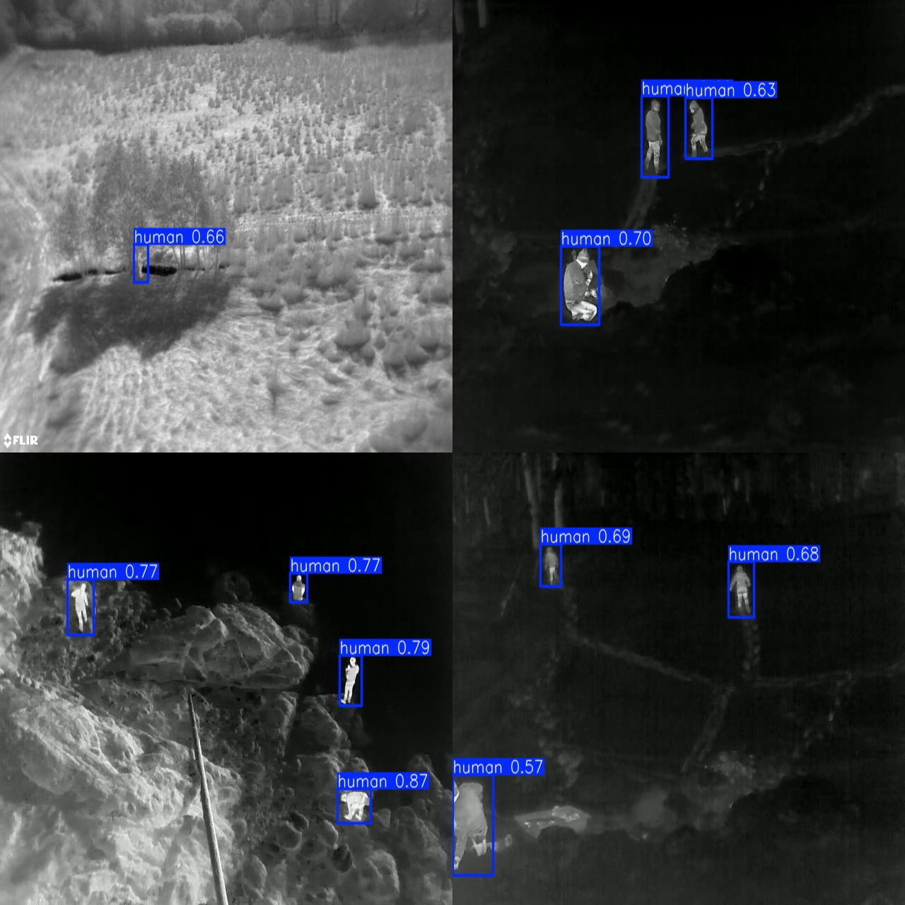
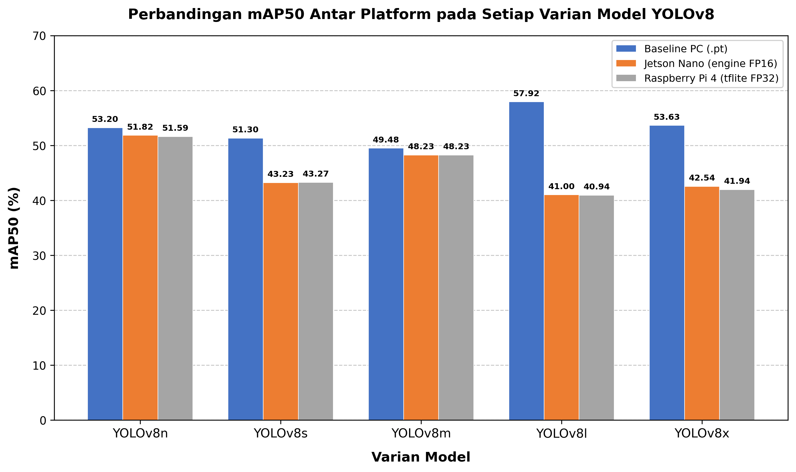
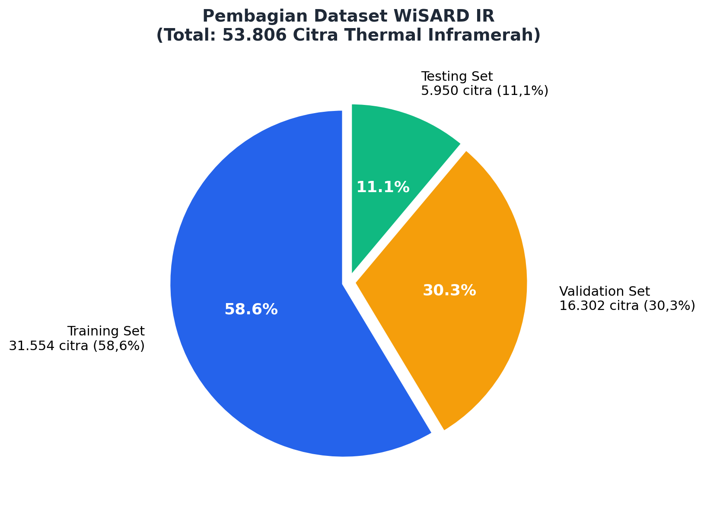

# 🔥 YOLOv8 Infrared Human Detection for Drone-Based Search and Rescue

[](https://python.org)
[](https://docs.ultralytics.com)
[](LICENSE)
[](https://developer.nvidia.com/embedded/jetson-nano)

> **Benchmarking YOLOv8 variants (n/s/m/l/x) for real-time infrared human detection on edge devices — targeting drone-based Wilderness Search and Rescue (WiSAR) operations.**

<p align="center">
  
</p>

---

## 📋 Table of Contents

- [Overview](#-overview)
- [Key Results](#-key-results)
- [Dataset](#-dataset)
- [Project Structure](#-project-structure)
- [Installation](#-installation)
- [Usage](#-usage)
  - [Training](#1-training)
  - [Model Conversion](#2-model-conversion)
  - [Evaluation](#3-evaluation)
  - [Benchmarking](#4-benchmarking)
- [Model Weights](#-model-weights)
- [Hardware Specifications](#-hardware-specifications)
- [Citation](#-citation)
- [License](#-license)

---

## 🔍 Overview

This research benchmarks all five YOLOv8 variants for **thermal infrared human detection** optimized for edge deployment on drones. The system is designed for **Wilderness Search and Rescue (WiSAR)** operations where detecting humans in challenging environments (night, fog, dense vegetation) is critical.

### Architecture Pipeline

```
                    ┌──────────────┐
                    │  WiSARD IR   │
                    │   Dataset    │
                    │  53,806 imgs │
                    └──────┬───────┘
                           │
                    ┌──────▼───────┐
                    │   Training   │
                    │  YOLOv8 n/s/ │
                    │   m/l/x      │
                    │  (RTX 3060)  │
                    └──────┬───────┘
                           │
              ┌────────────┼────────────┐
              │                         │
       ┌──────▼───────┐         ┌──────▼───────┐
       │  ONNX → TRT  │         │  ONNX → TFL  │
       │  (FP16)      │         │  (FP32)      │
       └──────┬───────┘         └──────┬───────┘
              │                         │
       ┌──────▼───────┐         ┌──────▼───────┐
       │ Jetson Nano   │         │ Raspberry    │
       │ Inference +   │         │ Pi 4         │
       │ Benchmark     │         │ Inference +  │
       └───────────────┘         │ Benchmark    │
                                 └──────────────┘
```

### Key Features
- **5 YOLOv8 variants** trained with identical hyperparameters (fair comparison)
- **Thermal/IR-specific augmentation** (no HSV hue/saturation changes)
- **Edge deployment** on Jetson Nano (TensorRT FP16) & Raspberry Pi 4 (TFLite FP32)
- **Comprehensive benchmarking**: accuracy (mAP), latency, FPS, power, temperature

---

## 📊 Key Results

### Training Performance (RTX 3060 12GB)

| Model | Parameters | mAP50 (%) | mAP50-95 (%) | Training Time |
|-------|-----------|-----------|--------------|---------------|
| YOLOv8n | 3.2M | 53.20 | — | ~3–5 hrs |
| YOLOv8s | 11.2M | 51.30 | — | ~6–8 hrs |
| YOLOv8m | 25.9M | 49.48 | — | ~10–14 hrs |
| YOLOv8l | 43.7M | 57.92 | — | ~18–24 hrs |
| YOLOv8x | 68.2M | 53.63 | — | ~24–36 hrs |

### Edge Device mAP50 Comparison

| Model | Baseline PC (.pt) | Jetson Nano (FP16) | Raspberry Pi 4 (FP32) |
|-------|-------------------|--------------------|-----------------------|
| YOLOv8n | 53.20% | 51.82% | 51.59% |
| YOLOv8s | 51.30% | 43.23% | 43.27% |
| YOLOv8m | 49.48% | 48.23% | 48.23% |
| YOLOv8l | 57.92% | 41.00% | 40.94% |
| YOLOv8x | 53.63% | 42.54% | 41.94% |

<p align="center">
  
</p>

---

## 📦 Dataset

### WiSARD IR (Wilderness Search and Rescue Dataset — Infrared)

| Split | Images | Percentage |
|-------|--------|-----------|
| Training | 31,554 | 58.6% |
| Validation | 16,302 | 30.3% |
| Testing | 5,950 | 11.1% |
| **Total** | **53,806** | **100%** |

- **Task**: Single-class detection (`human`)
- **Image type**: Thermal infrared
- **Source**: Drone aerial footage

<p align="center">
  
</p>

> **Note:** The full dataset is not included in this repository due to its size (~8 GB).
> See [`dataset/README.md`](dataset/README.md) for download instructions.

---

## 📁 Project Structure

```
├── README.md                    # This file
├── LICENSE                      # MIT License
├── requirements.txt             # Python dependencies
├── .gitignore
│
├── dataset/                     # Dataset configuration & samples
│   ├── data.yaml                # YOLO dataset config
│   ├── sample_images/           # Sample thermal IR images
│   └── README.md                # Dataset download instructions
│
├── training/                    # Training scripts
│   ├── config.py                # Shared hyperparameters
│   ├── train_yolov8{n,s,m,l,x}.py
│   ├── train_all.py             # Train all variants
│   └── notebooks/               # Google Colab notebooks
│
├── models/                      # Model weights (see README for download)
│   └── README.md
│
├── conversion/                  # Model format conversion
│   ├── convert_to_onnx.py       # .pt → .onnx
│   ├── convert_onnx_to_trt.py   # .onnx → .engine (Jetson)
│   └── convert_to_tflite.py     # .pt → .tflite (Raspberry Pi)
│
├── evaluation/                  # Model evaluation scripts
│   ├── test_model_wisard.py     # Eval on WiSARD IR test set
│   ├── val.py                   # Validation split evaluation
│   └── evaluate_accuracy.py     # Accuracy evaluation
│
├── benchmarking/                # Edge device benchmarking
│   ├── benchmark_jetson.py
│   ├── power_logger.py
│   └── ...
│
├── visualization/               # Chart & figure generation
│   ├── generate_charts.py
│   ├── generate_map50_chart.py
│   └── ...
│
├── results/                     # Experimental results
│   ├── training/                # Training curves & metrics
│   ├── evaluation/              # Evaluation outputs
│   ├── benchmarking/            # Benchmark data
│   └── charts/                  # Generated figures
│
└── docs/                        # Additional documentation
    └── PANDUAN_EKSEKUSI_LENGKAP.md
```

---

## ⚙️ Installation

### Prerequisites
- Python 3.8+
- NVIDIA GPU with CUDA support (for training)
- [PyTorch](https://pytorch.org/get-started/locally/) with CUDA

### Setup

```bash
# Clone the repository
git clone https://github.com/Xisdev/performance-analysis-yolov8n-wisard.git
cd drone-wisard

# Create virtual environment
python -m venv venv
source venv/bin/activate  # Linux/Mac
# or
venv\Scripts\activate     # Windows

# Install dependencies
pip install -r requirements.txt
```

---

## 🚀 Usage

### 1. Training

Train YOLOv8 variants on the WiSARD IR dataset:

```bash
# Train a single variant
python training/train_yolov8n.py

# Train all variants sequentially
python training/train_all.py
```

All hyperparameters are centralized in [`training/config.py`](training/config.py). Key settings:
- **Optimizer**: AdamW (lr=0.001, weight_decay=0.01)
- **Epochs**: 400 with early stopping (patience=100)
- **Image size**: 640×640
- **IR-specific augmentation**: HSV hue/saturation disabled

### 2. Model Conversion

Convert trained models for edge deployment:

```bash
# Step 1: Convert .pt to .onnx (run on PC)
python conversion/convert_to_onnx.py

# Step 2: Convert .onnx to TensorRT (run on Jetson Nano)
python conversion/convert_onnx_to_trt.py --fp16

# Alternative: Convert to TFLite (for Raspberry Pi)
python conversion/convert_to_tflite.py
```

### 3. Evaluation

Evaluate model accuracy on the WiSARD IR test set:

```bash
# Evaluate on WiSARD IR test set
python evaluation/test_model_wisard.py

# Run validation
python evaluation/val.py
```

### 4. Benchmarking

Benchmark on edge devices:

```bash
# On Jetson Nano
python benchmarking/benchmark_jetson.py

# Generate analysis reports
python benchmarking/analyze_results.py
```

---

## 📥 Model Weights

Pre-trained model weights are available for download:

| Model | Format | Size | Download |
|-------|--------|------|----------|
| YOLOv8n | .pt | 6 MB | [Google Drive](https://drive.google.com/drive/folders/1KLwcvxjbaATgcCAOZ6mj9RvNxdj5eP0O?usp=sharing) |
| YOLOv8s | .pt | 22 MB | [Google Drive](https://drive.google.com/drive/folders/1KLwcvxjbaATgcCAOZ6mj9RvNxdj5eP0O?usp=sharing) |
| YOLOv8m | .pt | 52 MB | [Google Drive](https://drive.google.com/drive/folders/1KLwcvxjbaATgcCAOZ6mj9RvNxdj5eP0O?usp=sharing) |
| YOLOv8l | .pt | 87 MB | [Google Drive](https://drive.google.com/drive/folders/1KLwcvxjbaATgcCAOZ6mj9RvNxdj5eP0O?usp=sharing) |
| YOLOv8x | .pt | 137 MB | [Google Drive](https://drive.google.com/drive/folders/1KLwcvxjbaATgcCAOZ6mj9RvNxdj5eP0O?usp=sharing) |

> Place downloaded weights in the `models/` directory.

See [`models/README.md`](models/README.md) for detailed instructions.

---

## 🖥️ Hardware Specifications

### Training
| Component | Specification |
|-----------|---------------|
| GPU | NVIDIA RTX 3060 12GB VRAM |
| CPU | Intel i7-3770 |
| RAM | 16 GB DDR3 |

### Edge Devices

| Spec | Jetson Nano | Raspberry Pi 4 |
|------|-------------|-----------------|
| CPU | Quad-core ARM A57 @ 1.43 GHz | Quad-core Cortex-A72 @ 1.5 GHz |
| GPU | 128-core Maxwell | VideoCore VI |
| RAM | 4 GB LPDDR4 | 4 GB LPDDR4 |
| AI Accelerator | TensorRT (FP16) | — |
| Model Format | .engine (FP16) | .tflite (FP32) |

---

## 📄 Citation

If you use this work in your research, please cite:

```bibtex
@thesis{kusdinar2026wisard,
  title={Benchmarking YOLOv8 for Infrared Human Detection on Edge Devices in Drone-Based Search and Rescue},
  author={Kusdinar},
  year={2026},
  institution={[Universitas Garut]}
}
```

---

## 📝 License

This project is licensed under the MIT License — see the [LICENSE](LICENSE) file for details.

---

## 🙏 Acknowledgments

- [Ultralytics YOLOv8](https://github.com/ultralytics/ultralytics) — Object detection framework
- [WiSARD Dataset](https://sites.google.com/uw.edu/wisard/) — Thermal infrared dataset for search and rescue

